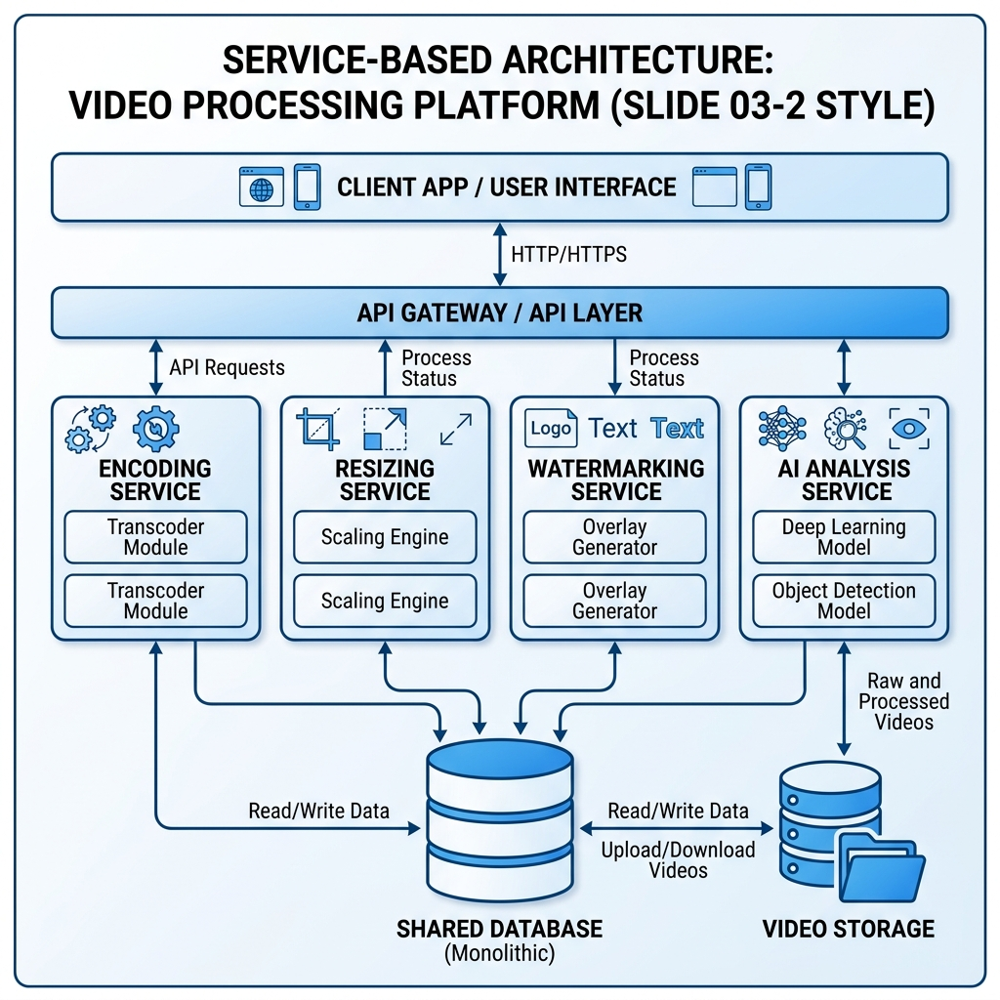

# Giải Bài Tập Giữa Kỳ - Kiến Trúc & Thiết Kế Phần Mềm

## Câu 3: Architecture Styles - Hệ Thống Xử Lý Video Online

### a. Lựa chọn kiến trúc
Kiến trúc phù hợp nhất cho hệ thống này (dựa trên các tiêu chí đánh giá trong Slide 03-2) là: **Service-based Architecture**.

### b. Giải thích lựa chọn (Dựa trên Slide 03-1 và 03-2)

#### 1. Tại sao chọn Service-based Architecture?
Dựa trên bảng đánh giá đặc tính kiến trúc (Slide 13 - bộ 03-2), Service-based Architecture là lựa chọn tối ưu vì:
*   **Deployability (4 sao):** Đáp ứng trực tiếp yêu cầu của đề bài về khả năng "**Deploy từng phần độc lập**". Các dịch vụ như Encoding, Resizing, AI Analysis có thể được phát triển và triển khai riêng biệt.
*   **Scalability & Performance (3 sao):** Đây là các mức đánh giá cao nhất trong số 4 kiến trúc được đưa ra (Layered, Microkernel, Pipeline đều chỉ đạt 1-2 sao). Điều này thỏa mãn yêu cầu "**Scalable**" và "**High performance**", đặc biệt là với các bước xử lý nặng như AI.
*   **Phân chia theo Domain (Slide 9 - bộ 03-2):** Cho phép tách các bước xử lý video thành các bộ dịch vụ coarse-grained (dịch vụ thô) độc lập. Các bước AI Analysis có thể được tách thành một dịch vụ riêng để chạy trên hạ tầng phần cứng chuyên dụng (GPU).
*   **Tính sẵn sàng cao (Reliability - 3 sao):** Việc tách nhỏ thành các service giúp hệ thống hoạt động ổn định hơn, lỗi ở một service (ví dụ AI lỗi) không làm sập toàn bộ hệ thống upload/stream.

#### 2. Tại sao KHÔNG chọn các kiến trúc còn lại?
*   **Pipeline Architecture (Slide 42 - bộ 03-1):** Mặc dù về lý thuyết Pipe-and-Filter rất hợp với luồng xử lý video, nhưng trong Slide bài học, kiến trúc này bị đánh giá rất thấp về **Scalability (1 sao)** và **Deployability (2 sao)**. Do đó không thỏa mãn các yêu cầu then chốt của đề bài.
*   **Layered Architecture (Slide 27 - bộ 03-1):** Nhận điểm thấp nhất (**1 sao**) ở hầu hết các tiêu chí quan trọng như Scalability, Performance, và Deployability.
*   **Microkernel Architecture (Slide 54 - bộ 03-1):** Dù có tính mở rộng cao nhưng lại bị giới hạn về **Scalability (1 sao)** và **Performance (1 sao)**, không phù hợp để xử lý các tác vụ render video và AI nặng nề.

### c. Lược đồ kiến trúc (Service-based Architecture)

