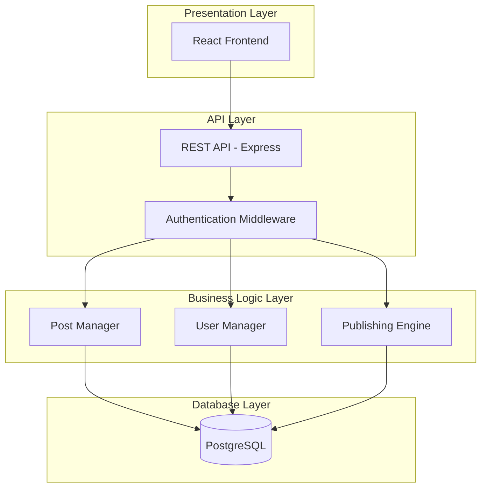
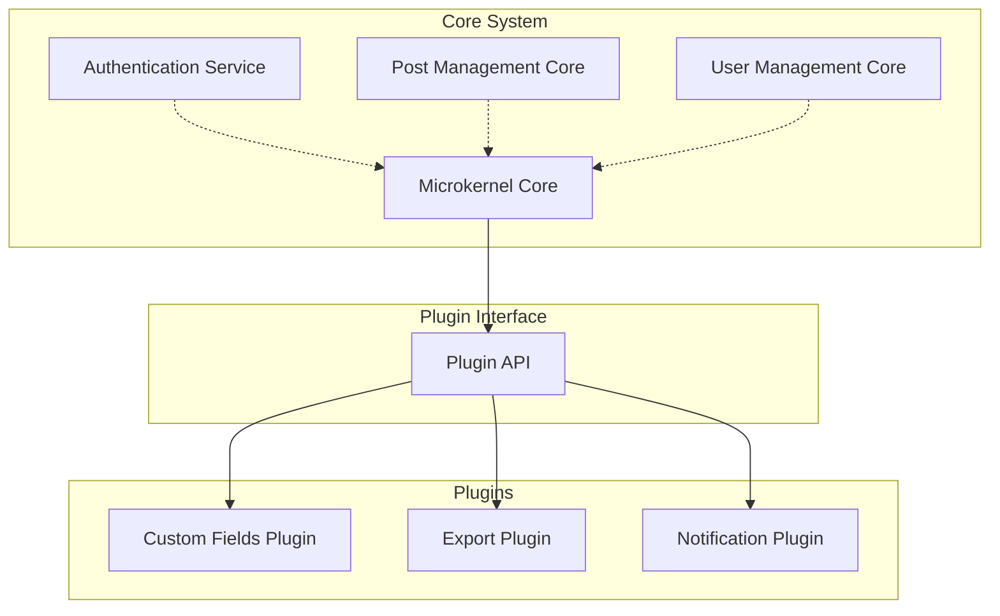
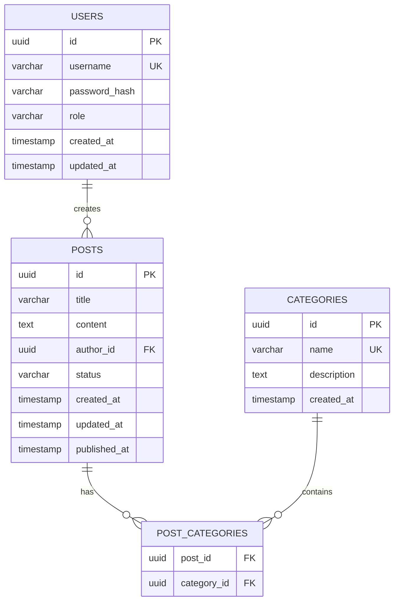
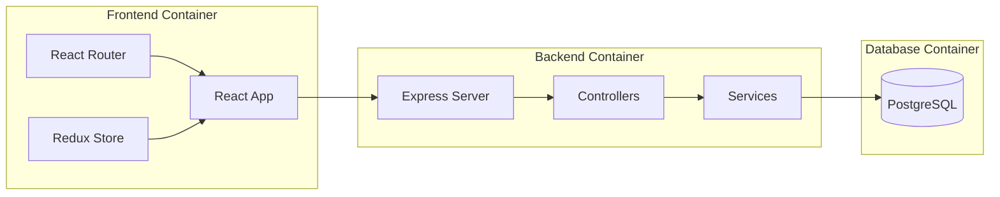
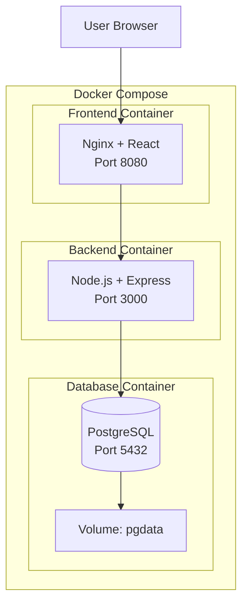
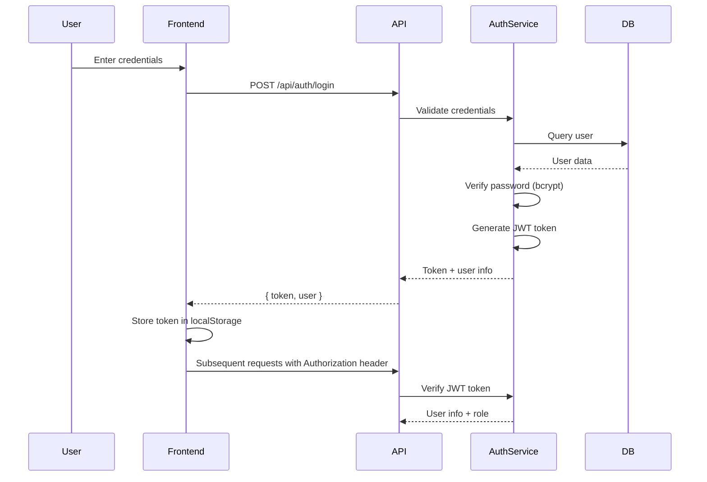
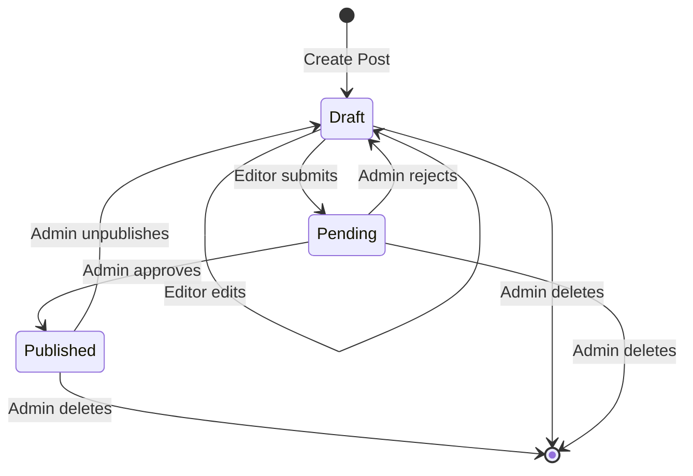

# Design Document - Hệ Thống CMS

## 1. Tổng Quan Hệ Thống

Hệ thống CMS được thiết kế theo hai kiến trúc chính:
- **Layer Architecture**: Phân tách rõ ràng các tầng xử lý
- **Microkernel Architecture**: Core system với khả năng mở rộng qua plugins

### 1.1 Mục Tiêu Thiết Kế

- Tách biệt concerns giữa các layer
- Dễ dàng mở rộng và bảo trì
- Hỗ trợ plugin architecture
- Triển khai containerized với Docker

## 2. High-Level Design

### 2.1 Layer Architecture

Hệ thống được tổ chức thành 4 lớp chính:



**Mô tả các lớp:**

1. **Presentation Layer**: Giao diện người dùng React, xử lý UI/UX
2. **API Layer**: REST API endpoints, authentication, request validation
3. **Business Logic Layer**: Core business rules, workflows
4. **Database Layer**: Data persistence với PostgreSQL

### 2.2 Microkernel Architecture



**Core System Components:**
- Authentication Service: JWT-based auth
- Post Management: CRUD operations
- User Management: Role-based access control

**Plugin Interface:**
- Standardized API cho plugins
- Event hooks: onCreate, onUpdate, onPublish
- Data extension points

### 2.3 Database Design (ERD)



### 2.4 Component Architecture



### 2.5 Docker Deployment Architecture



## 3. Low-Level Design

### 3.1 API Endpoints Specification

**Authentication:**
```
POST /api/auth/login
Request: { username, password }
Response: { token, user: { id, username, role } }
```

**Posts Management:**
```
GET    /api/posts              # List posts (with pagination)
GET    /api/posts/:id          # Get single post
POST   /api/posts              # Create post (Editor, Admin)
PUT    /api/posts/:id          # Update post (Editor, Admin)
DELETE /api/posts/:id          # Delete post (Admin only)
PATCH  /api/posts/:id/status   # Change status (Admin)
```

**Users Management:**
```
GET    /api/users              # List users (Admin)
GET    /api/users/:id          # Get user (Admin)
POST   /api/users              # Create user (Admin)
PUT    /api/users/:id          # Update user (Admin)
PATCH  /api/users/:id/role     # Change role (Admin)
```

**Categories:**
```
GET    /api/categories         # List categories
POST   /api/categories         # Create category (Admin)
PUT    /api/categories/:id     # Update category (Admin)
DELETE /api/categories/:id     # Delete category (Admin)
```

### 3.2 Database Schema Chi Tiết

**Table: users**
```sql
CREATE TABLE users (
    id UUID PRIMARY KEY DEFAULT gen_random_uuid(),
    username VARCHAR(50) UNIQUE NOT NULL,
    password_hash VARCHAR(255) NOT NULL,
    role VARCHAR(20) CHECK (role IN ('Admin', 'Editor', 'Viewer')) NOT NULL,
    created_at TIMESTAMP DEFAULT CURRENT_TIMESTAMP,
    updated_at TIMESTAMP DEFAULT CURRENT_TIMESTAMP
);

CREATE INDEX idx_users_username ON users(username);
```

**Table: posts**
```sql
CREATE TABLE posts (
    id UUID PRIMARY KEY DEFAULT gen_random_uuid(),
    title VARCHAR(255) NOT NULL,
    content TEXT NOT NULL,
    author_id UUID NOT NULL REFERENCES users(id) ON DELETE CASCADE,
    status VARCHAR(20) CHECK (status IN ('Draft', 'Pending', 'Published')) DEFAULT 'Draft',
    created_at TIMESTAMP DEFAULT CURRENT_TIMESTAMP,
    updated_at TIMESTAMP DEFAULT CURRENT_TIMESTAMP,
    published_at TIMESTAMP NULL
);

CREATE INDEX idx_posts_author ON posts(author_id);
CREATE INDEX idx_posts_status ON posts(status);
CREATE INDEX idx_posts_created ON posts(created_at DESC);
```

**Table: categories**
```sql
CREATE TABLE categories (
    id UUID PRIMARY KEY DEFAULT gen_random_uuid(),
    name VARCHAR(100) UNIQUE NOT NULL,
    description TEXT,
    created_at TIMESTAMP DEFAULT CURRENT_TIMESTAMP
);
```

**Table: post_categories**
```sql
CREATE TABLE post_categories (
    post_id UUID REFERENCES posts(id) ON DELETE CASCADE,
    category_id UUID REFERENCES categories(id) ON DELETE CASCADE,
    PRIMARY KEY (post_id, category_id)
);
```

### 3.3 Authentication Flow



### 3.4 Publishing Workflow State Machine



**State Transition Rules:**
- Draft → Pending: Editor or Admin
- Pending → Published: Admin only
- Pending → Draft: Admin only (with rejection reason)
- Published → Draft: Admin only
- Any state → Deleted: Admin only

### 3.5 Core Interfaces

**IPostService Interface:**
```typescript
interface IPostService {
  createPost(data: CreatePostDTO, userId: string): Promise<Post>;
  updatePost(id: string, data: UpdatePostDTO, userId: string): Promise<Post>;
  deletePost(id: string, userId: string): Promise<void>;
  getPost(id: string, userId: string): Promise<Post>;
  listPosts(filters: PostFilters, userId: string): Promise<PaginatedPosts>;
  changeStatus(id: string, status: PostStatus, userId: string): Promise<Post>;
}
```

**IUserService Interface:**
```typescript
interface IUserService {
  createUser(data: CreateUserDTO): Promise<User>;
  updateUser(id: string, data: UpdateUserDTO): Promise<User>;
  getUser(id: string): Promise<User>;
  listUsers(filters: UserFilters): Promise<PaginatedUsers>;
  changeRole(id: string, role: UserRole): Promise<User>;
}
```
